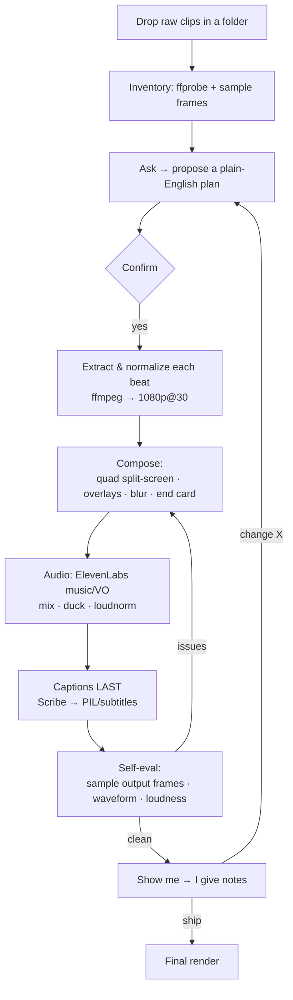

# 🎬 Editing product videos by *talking* to Claude Code

No timeline. No editor UI. No keyframes by hand.

I describe the edit in plain English — *"cut these four clips into a split-screen, build the
Pulse dashboard reveal, add music that builds and drops, put a 'Built with Claude Code' card at
the end that flies away"* — and [Claude Code](https://claude.com/claude-code) drives **ffmpeg**,
**ElevenLabs**, and a little **Python/Pillow** to actually cut, score, caption, animate, and render
the video. Then it samples frames from its own output, checks the audio, and fixes what's wrong
before showing me.

This repo documents the **stack** and the **flow** so you can reproduce it. It ships the
(generalized) scripts — not my source footage or brand assets.

> ⚠️ This is a *method* repo. It contains no video/audio assets. Drop your own clips in and go.

---

## The result

A ~30s LinkedIn reel built entirely through conversation:

- a 2×2 **split-screen** hero of four product-motion clips
- a **"type a request → the dashboard builds itself"** beat
- kinetic **captions** burned in for silent autoplay
- an original **music bed** with a real build/drop
- a blurred **end card** with a mascot that flies in, bounces, and flies away

*(Add your own `demo.gif` / `demo.mp4` here.)*

---

## The stack

See **[STACK.md](STACK.md)** for the full list and *why* each tool. The short version:

| Layer | Tool | Role |
|---|---|---|
| Orchestration | **Claude Code** | Reads intent, plans, runs every command, self-reviews output |
| Editing skill | **[video-use](https://github.com/browser-use/video-use)** (Claude skill) | The conversational "ask → confirm → execute → iterate" workflow — **install this first** |
| Media engine | **ffmpeg / ffprobe** | Cut, scale, split-screen, overlay, blur, fade, concat, mux |
| Music | **ElevenLabs Music** | Original, licensing-clean background tracks (build/drop) |
| Voiceover | **ElevenLabs TTS** (+ voice cloning) | Narration when a reel needs it |
| Captions | **ElevenLabs Scribe** | Word-level transcription → styled subtitles |
| Graphics | **Python + Pillow (PIL)** | End cards, captions, mascot animation, frame compositing |
| Motion graphics | **[HyperFrames](https://github.com/heygen-com/hyperframes)** *(HTML/CSS/GSAP)* | Web-authored motion overlays — **alternative: [Remotion](https://www.remotion.dev/)** (React) |
| AI b-roll | **[Higgsfield](https://higgsfield.ai/)** (MCP) / **[RunwayML](https://runwayml.com/)** (API) | Generate footage you don't have (image→video) — see [BROLL.md](BROLL.md) |
| Research | **yt-dlp** + Python | Pull reference videos, analyze tempo/loudness to match a vibe |

---

## The flow



The loop that makes it work is **step I → J**: Claude renders, then *looks at its own frames*
(`ffmpeg -ss ... -frames:v 1`), checks the audio waveform/loudness, and only surfaces the cut once
it passes. Every note I give ("meta part isn't in full", "0:22–0:25 is too slow", "make the music
build") re-enters the same loop.

Full walkthrough in **[WORKFLOW.md](WORKFLOW.md)**. Deep technique reference (cut craft, grading,
audio mixing, motion) in **[TECHNIQUES.md](TECHNIQUES.md)** and **[MOTION.md](MOTION.md)**.
Generative footage in **[BROLL.md](BROLL.md)**.

Need a shot you don't have? Generate it — **Higgsfield** (in-conversation via MCP) or **RunwayML**
(API) produce b-roll that gets normalized and folded into the same pipeline.

---

## What's in `scripts/`

| Script | What it does |
|---|---|
| [`extract_normalize.sh`](scripts/extract_normalize.sh) | Per-segment extract → uniform 1080p@30 (the safe way to concat) |
| [`quad_split.sh`](scripts/quad_split.sh) | 2×2 split-screen of four clips via `xstack` |
| [`concat.sh`](scripts/concat.sh) | Lossless `-c copy` concat of segments |
| [`gen_music.py`](scripts/gen_music.py) | ElevenLabs Music → an original track (with build/drop) |
| [`gen_voiceover.py`](scripts/gen_voiceover.py) | ElevenLabs TTS voiceover (bring your own voice id) |
| [`transcribe.py`](scripts/transcribe.py) | ElevenLabs Scribe word-level transcript |
| [`build_captions.py`](scripts/build_captions.py) | Kinetic captions **without libass** — PIL PNGs + `overlay` |
| [`end_card.py`](scripts/end_card.py) | Animated end card: text + mascot fly-in → bounce → fly-away |
| [`grade.sh`](scripts/grade.sh) | ASC-CDL color grade (per-segment presets + raw filters) |
| [`blur_and_mux.sh`](scripts/blur_and_mux.sh) | Blurred background + music mix (+ VO duck) + `loudnorm` |
| [`gen_broll_runway.py`](scripts/gen_broll_runway.py) | AI b-roll via the RunwayML API (image→video) |

### Docs

| Doc | What's in it |
|---|---|
| [STACK.md](STACK.md) | Every tool + why |
| [WORKFLOW.md](WORKFLOW.md) | The ask → confirm → execute → self-eval → iterate loop |
| [TECHNIQUES.md](TECHNIQUES.md) | Cut craft · transcription · grading · audio/music/VO · captions · compositing |
| [MOTION.md](MOTION.md) | Motion laws · easing tokens · kinetic type · engines · UI-spec-from-code · style system |
| [REFERENCES.md](REFERENCES.md) | Launch-video reference library — real films to study + archetypes/tone distilled from them |
| [BROLL.md](BROLL.md) | Generative footage — Higgsfield (MCP) & RunwayML (API) |
| [GOTCHAS.md](GOTCHAS.md) | The traps, by area |

Read **[GOTCHAS.md](GOTCHAS.md)** before you run anything — it lists the traps that cost me time
(ffmpeg builds with no `libass`, ElevenLabs prompt ToS, `sidechaincompress` length, single-use
filter labels, etc.).

---

## Setup

This repo is the *method* + helper scripts. The two engines that do the heavy lifting —
**video-use** (the editing skill) and **HyperFrames** (motion graphics) — are separate open-source
projects you install first. Neither is bundled here.

### 1. video-use — the editing skill (install first)

The conversational editing workflow, as a Claude Code skill →
**[github.com/browser-use/video-use](https://github.com/browser-use/video-use)**

```bash
# Easiest: paste this line into Claude Code and let it do the setup —
#   "Set up https://github.com/browser-use/video-use for me."

# Or manually:
git clone https://github.com/browser-use/video-use ~/Developer/video-use
ln -sfn ~/Developer/video-use ~/.claude/skills/video-use
cd ~/Developer/video-use && uv sync        # or: pip install -e .
```

### 2. HyperFrames — motion graphics (install when you need animated overlays)

HTML/CSS/GSAP → deterministic MP4/WebM → **[github.com/heygen-com/hyperframes](https://github.com/heygen-com/hyperframes)**
(needs **Node.js 22+**). Or use **[Remotion](https://www.remotion.dev/)** instead.

```bash
# With Claude Code / agents (recommended):
npx skills add heygen-com/hyperframes --full-depth
# Manual CLI:
npx hyperframes init my-video && cd my-video && npx hyperframes preview   # → npx hyperframes render
```

### 3. System tools + keys (for the scripts in this repo)

```bash
brew install ffmpeg yt-dlp                 # macOS (Linux: your package manager)
python3 -m pip install pillow requests
pipx install demucs                        # optional — voice cloning / stem split
cp .env.example .env                       # then paste your ElevenLabs (and Runway) keys
```

Fonts: any you like — the scripts default to Inter / Inter Display; pass `--font path/to/Bold.ttf`.
Drop a mascot/logo PNG in `assets/` if your end card uses one. Everything reads paths and keys from
env / argv — no absolute paths baked in.

---

## HyperFrames vs. Remotion

For richer motion graphics (kinetic type, UI-to-video, animated overlays) you author a composition
and render it to MP4/WebM:

- **HyperFrames** — HTML/CSS/GSAP, browser-rendered, deterministic frame capture.
- **[Remotion](https://www.remotion.dev/)** — the React alternative. Same idea, component-based;
  great if you'd rather write JSX than HTML/CSS. `npx create-video@latest` → `remotion render`.

Both drop a rendered clip that you overlay/concat with the rest of the ffmpeg pipeline.

---

## Notes

- **Anonymized:** no source footage, brand assets, voice ids, or API keys are included.
- **Music & copyright:** *generate* your beds (licensing-clean) rather than ripping a track from
  someone's video. Reference tracks are for matching a *vibe*, not for shipping.
- **License:** [MIT](LICENSE) — do whatever, no warranty.

Built by talking to Claude Code. 🟧
